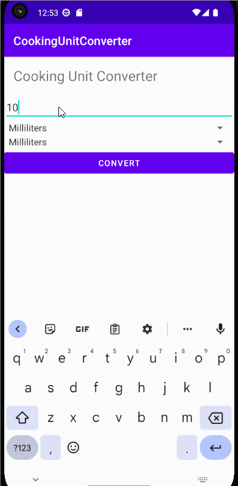

# Unit-Converter-App

Code for Android Basics Codelab.

Introduction
------------

A unit converter is a App that allows you to convert measurements from one unit to another. In the case of converting milliliters to fluid ounces, grams, and cups, and vice versa,

Pre-requisites
--------------

You need to know:
- How to open, build, and run apps with Android Studio.
- What an activity is, and how to create one in your app.
- What the activity's onCreate() method does, and the kind of    operations
  that are performed in that method.

 Formulas:
--------------

You need to know:
   1. Milliliters = Fluid Ounces * 29.5735.
   2. Grams = Milliliters * Density.
   3. Cups = Milliliters / 236.59.
  
  

Getting Started
---------------

1. Download and run the app.

 Demo of the App
 ----------------

## Author

- [Raban Kathariya](https://www.github.com/raban2)

